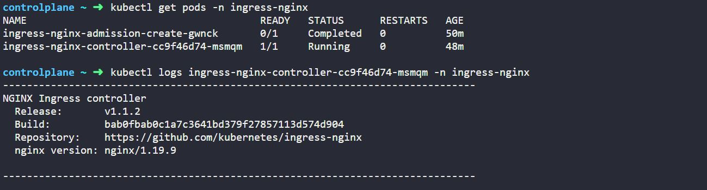

<a name="readme-top"></a>

[![LinkedIn][linkedin-shield]][linkedin-url]


<!-- PROJECT LOGO -->
<br />
<div align="center">
  
  <h3 align="center">Nginx Ingress Setup with Proxy on Bare Metal Kubernetes Cluster</h3>
</div>


<!-- TABLE OF CONTENTS -->
<details>
  <summary>Table of Contents</summary>
  <ol>
    <li><a href="#about-the-project">About The Project</a></li>
    <li><a href="#description">Description</li>
    <li><a href="#ingress-nginx-deployment">Ingress Nginx Deployment</a></li>
    <li><a href="#nginx-reverse-proxy-setup">Nginx Reverse Proxy Setup</a></li>
    <li><a href="#testing">Testing</a></li>
    <li><a href="#debugging-steps">Debugging Steps</a></li>
    <li><a href="#contact">Contact</a></li>
    <li><a href="#references">References</a></li>
  </ol>
</details>


<!-- ABOUT THE PROJECT -->
## About The Project


* Project Name: Nginx Ingress Setup with Proxy on Bare Metal Kubernetes Cluster
* Version: v1.0.0
* Organization Department: Technology

## Description

In this written guide, I documeneted my hands-on experience while deploying Nginx Ingress along with Nginx Proxy on my self-managed kuberentes cluster running Ubuntu 20.04.6 LTS on the cloud.

<p align="right">(<a href="#readme-top">back to top</a>)</p>

## Ingress Nginx Deployment

1. There is an officially Kubernetes manifest that groups all the resources that need to be created to deploy Ingress Nginx.
    * You can find the offical repo here:
        ```
        https://github.com/kubernetes/ingress-nginx/tree/main
        ```
    * The repo includes manifest files to deploy Ingress Nginx on multiple platforms, such as AWS and DigitalOcean. These manifest fiels create a Load Balancer outside your cluster then forwards the traffic to your Ingress Nginx deployment. That setup adds extra charges to your bill, of course.
    * There is also a manifest file for deploying Ingress Nginx on baremetal Kubernetes cluster.


    1. We can deploy the Ingress Nginx directly using the below command:

        ```
        kubectl apply -f https://raw.githubusercontent.com/kubernetes/ingress-nginx/main/deploy/static/provider/baremetal/deploy.yaml
        ```

    * Make sure that the output indicates that all resources were created and no errors present.

  2. We can verify the deployment by checking the deployment status and pods status as well. 
      * The deployment file that we used created a name space `ingress-nginx` and created the resources inside it.
      * We can list all the resources in that name space using the below command:

        ```
        kubectl get all -n ingress-nginx
        ```

      * We can verify that the deployment is successful by checking the deployment and pods status:


  3. The deployment of Ingress Nginx on bare-metal deploys a service called `ingress-nginx-controller` of type `NodePort`. That means the Ingress Nginx service will be accessible by a NodePort. Since the service manifest doesn't specify a NodePort, we can either use the NodePorts specified by Kubernetes or edit the service and specify desired ports.
      * Personally, I chose to edit the service and set the HTTP port to `30001` and HTTPS port to `30002`.
      * To edit the service, run the command below and add the desired NodePorts.

        ```
        kubectl edit svc ingress-nginx-controller -n ingress-nginx
        ```


  4. We can verify that Ingress Nginx listens successfully on the specified ports by using:

      ```
      curl http://localhost:30001
      ```

      ```
      curl http://localhost:30002
      ```


<p align="right">(<a href="#readme-top">back to top</a>)</p>

## Nginx Reverse Proxy Setup

As we deployed Ingress Nginx on a bare-metal Kuberentes cluster, the Ingress service was deployed as a NodePort service. That means we need to receieve the HTTP and HTTPs traffic somehow outside the cluster, then route that traffic to the ingress service.

The way I did it as follows:
  
  * To keep cost minimum, I added a docker container running Nginx as a reverse proxy on the master node.
  * The container listens on port 80 and port 443 and on server names matching the domain used to serve my application.
  * If any traffic received on port 80, it redirects it to port 443.
  * The container also contains a let's encrypt installation with a job running automatically every 12 hours to issue/renew a SSL certificate for my used domain.
  * In case of any future domains, I will need to include them in the Nginx configurations and let's encrypt periodic script.

With that setup, any traffic on my domains will be encrypted using SSL certificates that are automatically issued/renewed by Let's encrypt in the Nginx docker container. Then, it will be directed to Ingress Nginx Controller and finally to the specified service in the ingress resources that I define.

The setup contains 4 file:

1. Run `vim default.conf` and add below content. The `157.230.12.200` is any node ip in the cluster and the `30001` port is the HTTP nodePort of the ingress service. **A very important note here is to change the domain name in the ssl_certificate paths and server names in the below file.**

```
# Redirect all HTTP requests to HTTPS
server {
    listen 80;
    server_name mohamedabdelgawad.online www.mohamedabdelgawad.online;
    return 301 https://$host$request_uri;
}

server {
    listen 443 ssl;
    server_name mohamedabdelgawad.online www.mohamedabdelgawad.online;

    ssl_certificate /etc/letsencrypt/live/mohamedabdelgawad.online/fullchain.pem;
    ssl_certificate_key /etc/letsencrypt/live/mohamedabdelgawad.online/privkey.pem;

    location / {
        proxy_set_header Host $host;
        proxy_pass http://157.230.12.200:30001;
    }
}
```

2. Run `vim generate_certificate.sh` and add below content.

```
#!/bin/bash

# This script generates and renews the SSL certificate using Certbot

# Generate the initial certificate
certbot certonly --agree-tos --standalone --expand \
        -d mohamedabdelgawad.online \
        -d www.mohamedabdelgawad.online \
                -m  muhammadabdelgawwad@gmail.com  --redirect --non-interactive

# Move Nginx configurations to the appropriate location
mv /certgen/default.conf /etc/nginx/conf.d/default.conf

# Start Nginx
nginx -g "daemon off;" &

# Function to calculate the next check timestamp
calculate_next_check() {
    current_timestamp=$(date +%s)
    next_check_timestamp=$((current_timestamp + 12 * 60 * 60))  # Add 12 hours in seconds
    next_check_date=$(date -d @$next_check_timestamp)
    printf "\n\n Next certificate renewal check: $next_check_date \n\n"
}

# Continuously renew the certificate
while :
do
    certbot renew --nginx --quiet
    calculate_next_check  # Print the next check timestamp
    sleep 12h   # Sleep for 12 hours before checking for renewal again
done
```

3. Run `vim Dockerfile` and add below content.

```
FROM nginx:latest

# Install certbot to generate the SSL certificates
RUN apt-get update && apt-get install -y certbot python3-certbot-nginx

# Create the necessary directory and PID file for Nginx to use during reload operations
RUN mkdir -p /var/run && touch /var/run/nginx.pid

# Set the working directory
WORKDIR /certgen

# Copy the script to generate the SSL certificate
COPY generate_certificate.sh .

# Copy Nginx configurations to the working directory
COPY default.conf .

# Make the script executable
RUN chmod +x generate_certificate.sh

EXPOSE 80
EXPOSE 443

# Set the entrypoint command
ENTRYPOINT ["bash", "generate_certificate.sh"]
```

4. Run `vim docker-compose.yml` and add below content.

```
version: "3.8"

services:

  nginx_server:
    container_name: nginx_server
    image: nginx_server
    build: ./
    volumes:
      - letsencrypt:/etc/letsencrypt
    ports:
      - 80:80
      - 443:443
    restart: always

volumes:
  letsencrypt:
    name: letsencrypt
```

Once you've created all the previous files, run the below command to start the Nginx Proxy Server container in the background:

```
docker compose up --build -d
```

<p align="right">(<a href="#readme-top">back to top</a>)</p>

## Testing

To test our setup, we need the following:
1. A new name space to group our test resources.
2. A simple application that we can deploy to our cluster.
3. A service of type ClusterIP that exposes our application.
4. An Ingress resource that routes the traffic received on the Ingress Nginx Controller service to the application's service.

Let's check the detailed steps:

1. Create a new name space:

    ```
    kubectl create ns app-space
    ```

2. Deploy a simple application. I chose to deploy a simple web app that I saw in a kodekloud lab.

    ```
    vim test-deploy.yaml
    ```
    ```
    apiVersion: apps/v1
    kind: Deployment
    metadata:
      name: webapp-wear
      namespace: app-space
    spec:
      replicas: 1
      selector:
        matchLabels:
          app: webapp-wear
      strategy:
        rollingUpdate:
          maxUnavailable: 25%
        type: RollingUpdate
      template:
        metadata:
          labels:
            app: webapp-wear
        spec:
          containers:
          - image: kodekloud/ecommerce:apparels
            imagePullPolicy: Always
            name: simple-webapp
            ports:
            - containerPort: 8080
    ```
    ```
    kubectl apply -f test-deploy.yaml
    ```

3. Expose the deployed application using a ClusterIP service:
    
    ```
    vim test-service.yaml
    ```
    ```
    apiVersion: v1
    kind: Service
    metadata:
      name: wear-service
      namespace: app-space
    spec:
      ports:
      - port: 8080
        targetPort: 8080
      selector:
        app: webapp-wear
      type: ClusterIP
    ```
    ```
    kubectl apply -f test-service.yaml
    ```

4. Create an Ingress resource to route the traffic to the deployed application. The below resource specifies the domain in the host field and the path `/wear` to route to our application.

    ```
    vim test-ingress.yaml
    ```
    ```
    apiVersion: networking.k8s.io/v1
    kind: Ingress
    metadata:
      annotations:
        nginx.ingress.kubernetes.io/rewrite-target: /
      name: ingress-wear-watch
      namespace: app-space
    spec:
      ingressClassName: nginx
      rules:
      - host: mohamedabdelgawad.online
        http:
          paths:
          - path: /wear
            pathType: Prefix
            backend:
              service:
                name: wear-service
                port:
                  number: 8080
    ```
    ```
    kubectl apply -f test-ingress.yaml
    ```

We can test the Ingress setup away from the Nginx Proxy Server setup by simple opening `http://157.230.12.200:30001/wear` where the `157.230.12.200` is the IP of any node in the cluster and the `30001` is the NodePort of the ingress service. The application should open normally:


We can then test the full setup along with the Nginx Proxy server. We simple try to open `https://mohamedabdelgawad.online/wear`:


You can see that the application opens successfully with the domain name and SSL encryption enabled.

<p align="right">(<a href="#readme-top">back to top</a>)</p>

## Debugging Steps

**To be able to debug the full setup, we need to understand the exact flow of the traffic:**

1. The user opens `https://mohamedabdelgawad.online/wear` in the browser.
2. The DNS of the domain name points to the master node of the cluster. That's why the request will reach the master node on port 443.
3. The request goes to the Nginx proxy server where it checks the server name and port in the request. It finds that the server name is the domain listed in the configuration and the port is HTTPs (443). It terminates SSL using the certificate of the domain then route the traffic to Ingress Nginx service.
4. Ingress service pass the request to the Ingress Controller pods to handle the request.
5. The Ingress Controller pod check the request path and the applied Ingress rules. It finds that there is a rule for the path `/wear` on any host, and it should be routed to the service of the deployed application.
6. The application's service pass the request to a pod of the application to serve the request.
7. The request reach its final destination in the pod of the application.

**Now that we understand the life cycle of the request, we can start our debugging process:**

1. We try to open the URL `https://mohamedabdelgawad.online/wear` but we get 404 Not Found:


2. First, we check the logs of our application to validate if the request reached to the pod. We can see that the request never reached the application.


3. We take a step back and check the logs of the ingress controller to see if the request reached it but didn't route it. We can see in the bottom of the logs that the Ingress controller decided to ignore our ingress resource; because we didn't specify a valid IngressClass. We can see in the documentation that we need to specify the class name of the controller. The IngressClass in our case should be `nginx`.


4. Once we add the IngressClass to our ingress resource, the application should be accessible again. However, let's pretend that we didn't solve the issue and we need to further debug it. We then check the status of the Ingress deployment, pods and service to make sure everything is running:


5. We can finally check the logs of the Nginx proxy server to make sure that the request reach it and forwards it without any issues:


-----------------------------------------------------------------

**An interesting issue that I faced was the below error in the logs of the controller pod:**

```
Ignoring ingress because of error while validating ingress class" ingress="default/wear-watch-ingress" error="no object matching key \"nginx\" in local store
```

I've specified the IngressClass in the ingress rule as "nginx". However, the controller tells us that there is no IngressClass with that name.  **How to debug this issue?**

1. We check if there is an IngressClass already defined by running:
    ```
    kubectl get IngressClass
    ```
2. If there are any defined IngressClass, we get its name by running the below command and checking the name field in the metadata section.
    ```
    kubectl get IngressClass -o yaml
    ```


3. In my case, there wasn't an IngressClass defined. So, I had to define my IngressClass. I searched the <a href="https://kubernetes.io/docs/concepts/services-networking/ingress/#ingress-class">documentation</a> on how to create the IngressClass resource.


4. There are three fields that we need to edit in the example IngressClass: `name`, `parameters`, and `controller`. 

    * The `name` field should be specified as we already specified in the Ingress resource before.
    * The `parameters` field can be deleted.
    * The `controller` should be the exact controller name deployed in the cluster. The controller name is defined as an argument in the deployment resource as `--controller-class=k8s.io/ingress-nginx`. So, the `controller` should be `k8s.io/ingress-nginx`.


5. So, the full IngressResource should be defined as below:
```
apiVersion: networking.k8s.io/v1
kind: IngressClass
metadata:
  name: nginx
spec:
  controller: k8s.io/ingress-nginx
```

6. We put the definition in a file then create it:
```
kubectl apply -f IngressClass.yaml
```

7. Finally, we need to delete the ingress rule that we've created before then recreate it again for the controller to notice it:





<p align="right">(<a href="#readme-top">back to top</a>)</p>

<!-- CONTACT -->
## Contact

Mohamed AbdelGawad Ibrahim - [@m-abdelgawad](https://www.linkedin.com/in/m-abdelgawad/) - <a href="tel:+201069052620">+201069052620</a>

<p align="right">(<a href="#readme-top">back to top</a>)</p>

## References

* https://github.com/kubernetes/ingress-nginx/blob/main/deploy/static/provider/baremetal/deploy.yaml
* https://kubernetes.io/docs/concepts/services-networking/ingress/


<p align="right">(<a href="#readme-top">back to top</a>)</p>

<!-- MARKDOWN LINKS & IMAGES -->
<!-- https://www.markdownguide.org/basic-syntax/#reference-style-links -->
[linkedin-shield]: https://img.shields.io/badge/-LinkedIn-black.svg?style=for-the-badge&logo=linkedin&colorB=555
[linkedin-url]: https://www.linkedin.com/in/m-abdelgawad/
